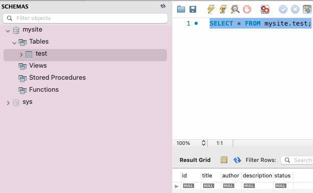
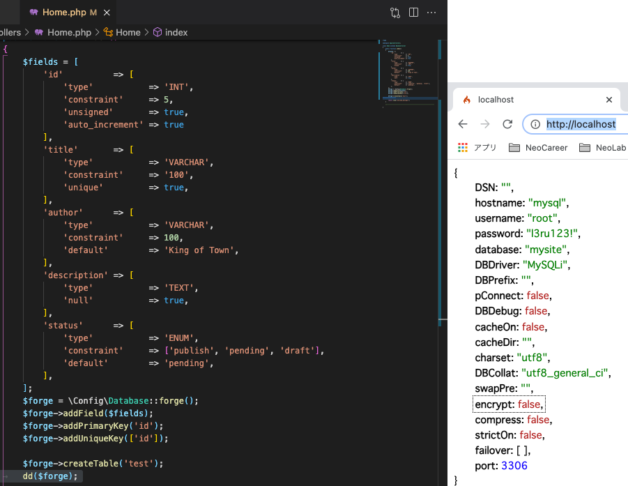

# ci4-nginx-connectdb-sample 🧨

[](https://github.com/tquangdo/ci4-nginx-connectdb-sample/issues/new)

## Note
1. If occur ERR "writable cannot be written" then:
```bash
    docker exec -it nginx_url bash
    cd /var/www
    chmod -R 777 writable/
```
2. 'Dockerfile' NOT have cmd for install composer
3. Reset mysql data
    ```bash
    bash reset-db.sh
    ```
4. NOT use file `spark` (Ex: for `app/Config/Migrations.php: php spark migrate:create`)

## Directory Structure
```sh
codeigniter-docker
├── docker
│   ├── mysql
│   │   └── based.sql
│   ├── nginx
│   │   └── nginx.conf
│   └── php
│       └── Dockerfile
├── docker-compose.yml
└── reset-db.sh
```

## Setup Initial DB  
Copy your sql file to *docker/mysql* with *based.sql* as a file name.


## Deploy local
1. `www/codeigniter4/app/Config/Database.php`
```php
public function __construct() {
    ...
    else {
	echo json_encode($this->default);
    }
}
```
2. `www/codeigniter4/app/Controllers/Home.php`
+ test connect DB:
```php
public function index()
{
    $fields = [
    	'id'          => [
    			'type'           => 'INT',
    			'constraint'     => 5,
    			'unsigned'       => true,
    			'auto_increment' => true
    	],
    	'title'       => [
    			'type'           => 'VARCHAR',
    			'constraint'     => '100',
    			'unique'         => true,
    	],
    	'author'      => [
    			'type'           =>'VARCHAR',
    			'constraint'     => 100,
    			'default'        => 'King of Town',
    	],
    	'description' => [
    			'type'           => 'TEXT',
    			'null'           => true,
    	],
    	'status'      => [
    			'type'           => 'ENUM',
    			'constraint'     => ['publish', 'pending', 'draft'],
    			'default'        => 'pending',
    	],
    ];
    $forge = \Config\Database::forge();
    $forge->addField($fields);
    $forge->addPrimaryKey('id');
    $forge->addUniqueKey(['id']);

    $forge->createTable('test');
    dd($forge);
    
    return view('welcome_message');
}
```
3. `www/codeigniter4/.env` (copy paste from `env`)
+ edit setting config, for ex:
```php
CI_ENVIRONMENT = development
...
database.default.hostname = codeigniter4_mysql
database.default.database = codeigniter4
database.default.username = codeigniter4
database.default.password = codeigniter4
database.default.DBDriver = MySQLi
```
4. `docker-compose up -d`
5. access browser `http://localhost/`
- => echo output DB connection's info on browser


